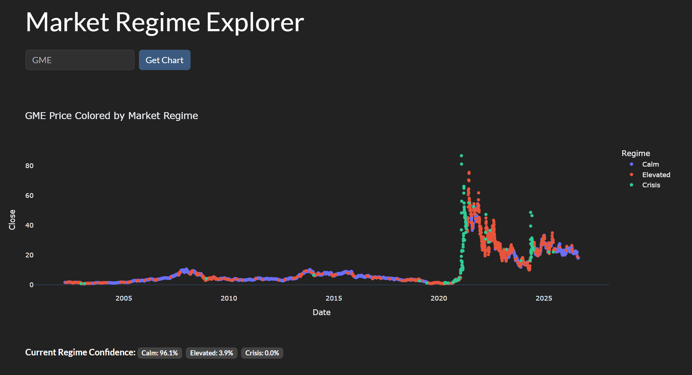
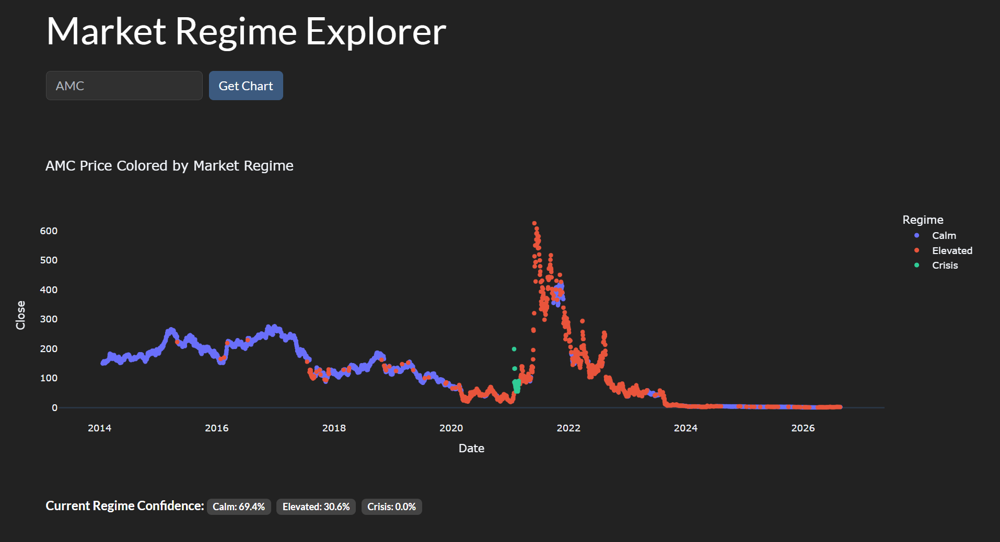
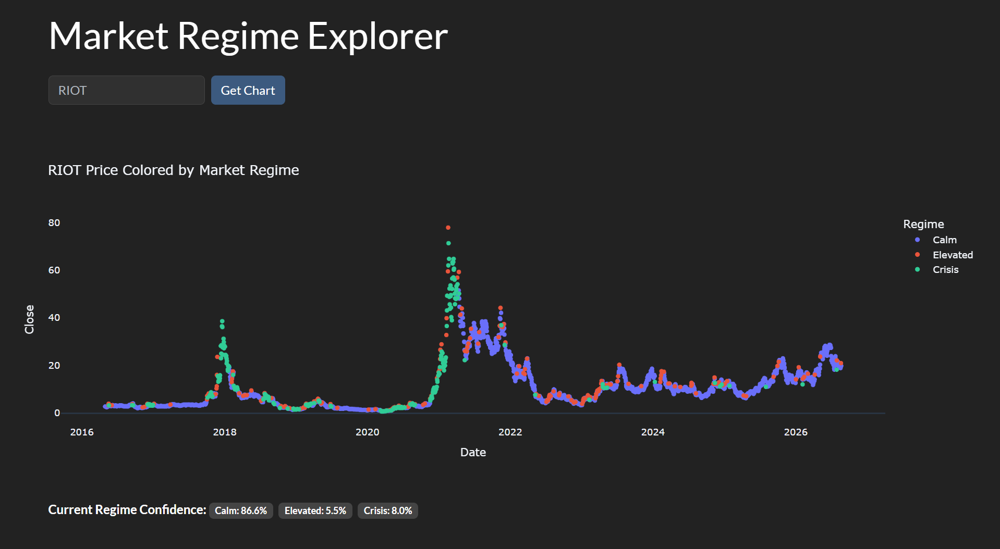

# Market Regime Explorer

An interactive web app that uses unsupervised machine learning to detect and visualize market "regimes" — calm, elevated-stress, and crisis periods — for any stock ticker, based purely on price returns and volatility.

## Screenshots


*GME's 2021 short squeeze automatically flagged as a distinct high-volatility regime*


*AMC's meme-stock era volatility, detected the same way*


*RIOT's crypto-correlated swings — same model, no retraining needed*

## What it does

Financial markets don't behave the same way all the time. Some periods are calm and steady; others are volatile and panicked. This project uses a **Gaussian Mixture Model (GMM)** to automatically discover these distinct "regimes" from historical price data — without ever being told what a crash looks like.

Type in any stock ticker, and the app will:
1. Pull its full historical daily price data
2. Compute daily returns and 21-day rolling volatility
3. Cluster each trading day into one of three regimes using GMM
4. Automatically label the regimes (Calm / Elevated / Crisis) based on their volatility profile
5. Render an interactive, colored chart of price history by regime
6. Show the current day's live regime confidence breakdown

## Why Gaussian Mixture Models

Most clustering tutorials reach for K-Means first — hard cluster boundaries, each point assigned to exactly one group. Markets don't actually work that way: the shift from a calm market into a crisis is gradual, not a light switch flipping. GMM models each regime as a probability distribution rather than a hard boundary, so it can represent a day as "70% calm, 30% transitioning to high-vol" — a far more realistic picture of how volatility actually clusters in real markets.

The app surfaces this directly — alongside the regime-colored chart, it displays the current day's live probability breakdown (e.g. "Calm: 82%, Elevated: 15%, Crisis: 3%"), computed from the model's `predict_proba()` output, rather than just showing a single hard-assigned label.

## Validation against real history

The model was never told what a financial crisis looks like — it only ever sees two numbers per day: return and rolling volatility. Despite that, running it on SPY (S&P 500) independently recovered several well-known market stress periods as its own "Crisis" cluster, including:

- The October 1997 mini-crash (Asian Financial Crisis spillover)
- The 2008 Global Financial Crisis
- The March 2020 COVID crash
- The 2022 inflation/rate-hike selloff
- The April 2025 tariff-driven volatility spike

None of these dates were hardcoded or used as labels during training — the model discovered them purely from the shape of the return/volatility data.

## Tech stack

- **Python** — pandas, scikit-learn (GaussianMixture, StandardScaler)
- **yfinance** — live historical price data for any ticker
- **Plotly** — interactive, dark-themed charting
- **Flask** — web app framework
- **Bootstrap 5 (Darkly theme)** — UI styling

## Project structure

```
├── app.py            # Flask routes and web app entry point
├── data.py           # Ticker data loading + feature engineering
├── clustering.py      # GMM fitting and regime labeling
├── visual.py          # Interactive Plotly chart generation
├── screenshots/        # Example regime charts (GME, AMC, RIOT)
└── templates/
    └── index.html      # Web UI
```

## Running locally

```bash
pip install flask yfinance pandas scikit-learn plotly
python app.py
```

Then visit `http://localhost:5000` and enter any stock ticker.
